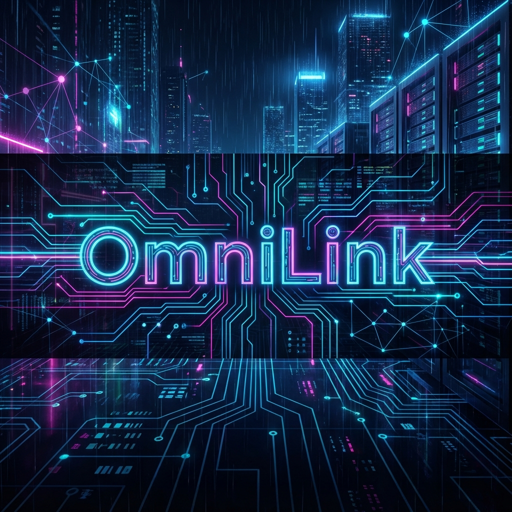
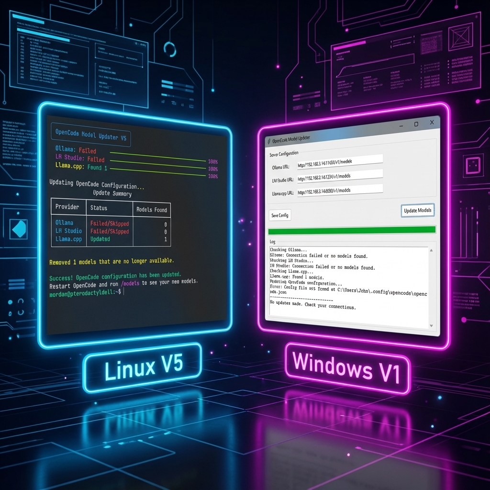

# 🔗 OmniLink
### The Universal Neural Bridge



  

**Connect your Intelligence. Unify your Workflow.**

OmniLink is the vital synapse between your local AI backends and your development environment. It automatically synchronizes models from **Ollama**, **LM Studio**, and **Llama.cpp** directly into **OpenCode**, ensuring your coding assistant always has access to your latest local LLMs.

No more manual config editing. No more copy-pasting API keys. Just flow.



---

## ✨ Features

*   **🔌 Universal Adapter**: Scans multiple providers (Ollama, LM Studio, Llama.cpp) concurrently.
*   **🔄 Auto-Sync**: Detects new `.gguf` models or pulled Ollama blobs and instantly updates your OpenCode config.
*   **🧹 Smart Garbage Collection**: Automatically prunes dead links to models you've deleted.
*   **📊 Visual Telemetry**:
    *   **Linux**: Slick Terminal UI (TUI) with progress bars and status tables.
    *   **Windows**: Native GUI for a seamless desktop experience.
*   **🧠 Context Awareness**: Remembers your server configurations (Localhost vs Network) so you only set them up once.

## 📦 Installation

### 🐧 Linux (OmniLink v5 - Recommended)
*Perfect for headless servers or desktop Linux.*

1.  **Install**:
    ```bash
    cd Update-LM-Models/V5
    chmod +x install.sh
    ./install.sh
    ```
2.  **Run**:
    Just type `mu` in your terminal.
    *(mu = Model Updater)*

### 🪟 Windows (OmniLink v1 - Recommended)
*Native application for Windows 10/11.*

1.  **Install**:
    Navigate to `Update-LM-Models/Windows_V1` and run `install.bat`.
2.  **Run**:
    Launch **"OmniLink"** (formerly OpenCode Model Updater) from your Desktop shortcut.

### 👴 Legacy (v4 - Bash Script)
1. **Make executable**: `chmod +x Update-LM-Models/V4/update-models.sh`
2. **Run it**: `./Update-LM-Models/V4/update-models.sh`

## 📋 Requirements

*   **Backends**: Running instance of Ollama, LM Studio, or Llama.cpp.
*   **Linux**: Python 3.
*   **Windows**: Python 3 added to PATH.

## 🤝 Support the Project

If OmniLink streamlines your AI workflow, consider fueling the development!

[](https://www.paypal.com/paypalme/GeekJohn)

---
*Connecting the dots in your local AI ecosystem.*
