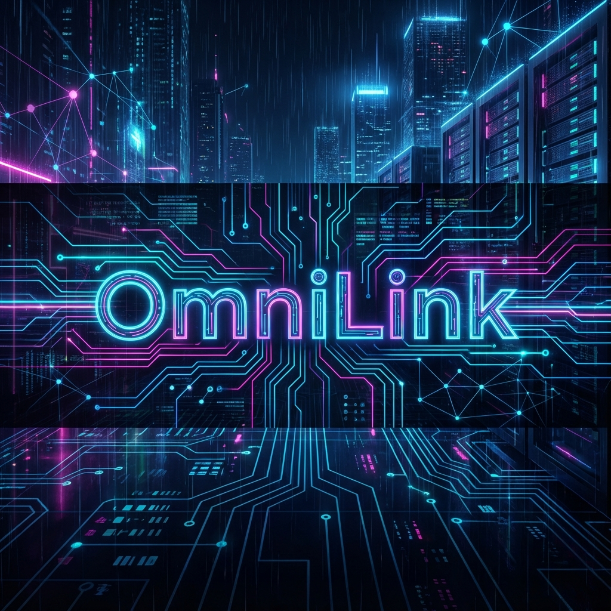
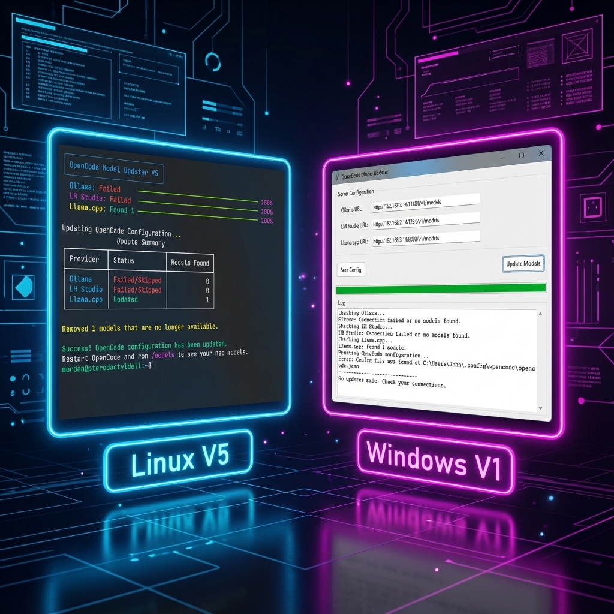

# 🔗 OmniLink
### The Universal Neural Bridge



  

**Connect your Intelligence. Unify your Workflow.**

OmniLink is the vital synapse between your local AI backends and your development environment. It automatically synchronizes models from **Ollama**, **LM Studio**, and **Llama.cpp** directly into **OpenCode**, ensuring your coding assistant always has access to your latest local LLMs.

No more manual config editing. No more copy-pasting API keys. Just flow.



---

## ✨ Features

*   **🔌 Universal Adapter**: Scans multiple providers (Ollama, LM Studio, Llama.cpp) concurrently.
*   **🔄 Auto-Sync**: Detects new models and instantly updates your OpenCode config.
*   **🧹 Smart Garbage Collection**: Automatically prunes dead links to models you've deleted.
*   **📁 Flexible Config Path**: Browse and select your own `opencode.json` location.
*   **🛠️ Auto-Create Config**: Creates the config file if it doesn't exist.
*   **📊 Visual Telemetry**:
    *   **Linux**: Slick Terminal UI (TUI) with progress bars and status tables.
    *   **Windows**: Cyberpunk-themed GUI with neon aesthetics.
*   **🧠 Context Awareness**: Remembers your server configurations so you only set them up once.

---

## 📦 Download

### [⬇️ Latest Release: OmniLink V0.1 BETA](https://github.com/mordang7/OmniLink/releases/tag/v0.1-beta)

| Platform | Download |
|----------|----------|
| 🐧 Linux | [OmniLink_V0.1_BETA_Linux.7z](https://github.com/mordang7/OmniLink/releases/download/v0.1-beta/OmniLink_V0.1_BETA_Linux.7z) |
| 🪟 Windows | [OmniLink_V0.1_BETA_Windows.7z](https://github.com/mordang7/OmniLink/releases/download/v0.1-beta/OmniLink_V0.1_BETA_Windows.7z) |

---

## 🚀 Installation

### 🐧 Linux

1.  **Extract** the archive
2.  **Install**:
    ```bash
    chmod +x install.sh
    ./install.sh
    ```
3.  **Run**: Type `omnilink` in your terminal

### 🪟 Windows

1.  **Extract** `OmniLink.exe` from the archive
2.  **Run**: Double-click `OmniLink.exe`

*No Python installation required - standalone executable!*

---

## 📋 Requirements

*   **Backends**: Running instance of Ollama, LM Studio, or Llama.cpp
*   **Linux**: Python 3 (for installation only)
*   **Windows**: None (standalone .exe)

---

## 🤝 Support the Project

If OmniLink streamlines your AI workflow, consider fueling the development!

[](https://ko-fi.com/geekj)

---
*Connecting the dots in your local AI ecosystem.*
